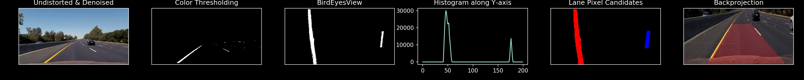

# Lane Detection

This is the simple Lane Detection project of the Perception for Autonomous Robots (ENPM 673) course.

In this implementation, I applied few computer vision techniques to detect the road lanes, road radius curvature and turn prediction. The dataset was captured by monocular camera and supplied by Udacity.

## Pipeline of the project

- Undistort and denoise the images
- Thresholding for lanes
	- Color Thresholding
	- Gradient Thresholding
- Perspective Transform i.e., Bird's eye view
- Find Lane Pixel Candidates
	- Histogram of Lane Pixels
	- Lane Curvature and Turn Prediction
	- Warping back the Lane area

