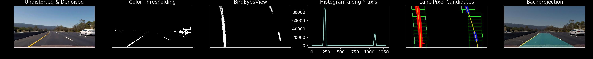

# Lane Detection

This is the Lane Detection project of the Perception (ENPM 673) course . You can find all of my implementations related to this project in this repo on github (hyperlink).

In this implementation, I applied few computer vision techniques to detect the road lanes, road radius curvature and turn prediction. The dataset was captured by monocular camera and supplied by Udacity.

## Pipeline of the project

- Undistort and denoise the images
- Thresholding for lanes
	- Color Thresholding
	- Gradient Thresholding
- Perspective Transform i.e., Bird's eye view
- Find Lane Pixel Candidates
	- Histogram of Lane Pixels
	- Lane Curvature and Turn Prediction
	- Warping back the Lane area

### Undistort and denoise the images

The `cv2.undistort` function takes an image, and camera parameters k, dist, and returns an undistorted image.

The `cv2.fastNlMeansDenoisingColored` function takes an image and gives us denoised image. 

With usage of these two functions, we get the Undistorted and denoised images.

### Thresholding for Lanes
#### Color Thresholding

Lanes are mostly in white and yellow in color. So, color segmentation might be ideal. Firstly, RGB color space converted to HSV space in `color_seg` function which takes an undistort and denoised image, and returns an binary image.

#### Gradient Thresholding

### Prespective Transform

To be able to detect the road lines, the preferred method is bird's eye view. The function `BirdsEyeView` takes an image and perfom perspective transform based on src and dst points. This function returns two matrixes `im_persp` and `invM` which are top view image and inverse perspective matrix for further uses respectively.

### Find Lane Pixel Candidates
